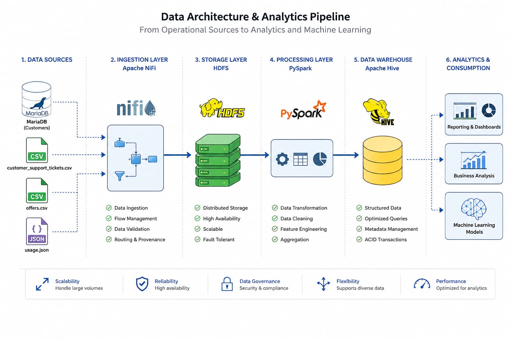

# Customer Churn Analysis & Retention Solution

An end-to-end data engineering project that transforms raw, messy customer data into a churn-ready data warehouse — built on a Medallion Architecture (Bronze → Silver → Gold) using Apache NiFi, PySpark, and Apache Hive.

## 🎯 Business Problem

Customer churn is expensive: acquiring a new customer typically costs far more than retaining an existing one. This project answers one core question:

> **Which customers are likely to leave, and why — early enough to act?**

To answer that reliably, customer behavior scattered across support tickets, marketing offers, and product usage needed to be unified into a single, fast-to-query data model, with business-relevant features engineered directly into the warehouse to support churn prediction.

## 🏗️ Architecture

This project follows a **Medallion Architecture**:

```
Bronze (Raw)  →  Silver (Cleaned)  →  Gold (Modeled / Star Schema)
```



| Layer | Purpose | Tech |
|---|---|---|
| **Bronze** | Raw ingestion from source systems, no transformation | Apache NiFi, HDFS |
| **Silver** | Data cleaning, standardization, deduplication | PySpark |
| **Gold** | Star schema data warehouse, analytics-ready | Apache Hive, Parquet |

### Data Sources

| Source | Format | Description |
|---|---|---|
| `customers` | RDBMS (via Sqoop/DB) | Customer profile & account attributes |
| `customer_support_tickets` | CSV | Support interactions, issue type, severity |
| `offers` | CSV | Marketing offers extended to customers |
| `usage` | JSON | Product/account usage logs |

## 📐 Data Modeling

### Why Star Schema (not Galaxy Schema)

Customer behavior lives across three different activity types (tickets, offers, usage). Rather than building a separate fact table per activity — which would require multiple joins to answer even a simple question about a customer — this project uses a **single, unified fact table**. This design choice was driven by the business need to evaluate a customer's *complete* behavior in one fast query, since churn risk depends on the full picture, not on any one data source in isolation.

### The Model

**Grain:** One row in the fact table = one customer activity event (a ticket, an offer, or a usage log entry).


- **Fact_Customer_Activity** — the central fact table; `event_type` distinguishes Ticket / Offer / Usage rows
- **Dim_Customer** — customer profile plus two engineered features:
  - `CLV_LTV` — estimated Customer Lifetime Value
  - `avg_ticket_res_time_hrs` — average support resolution time
- **Dim_Product**, **Dim_Ticket**, **Dim_Offer** — descriptive attributes per activity type
- **Dim_Date** — shared calendar dimension

### Why These Features Matter

- **CLV_LTV**: Not every customer carries equal weight. This feature lets retention efforts and offers be prioritized toward high-value, at-risk customers instead of being spread evenly.
- **avg_ticket_res_time_hrs**: Customers who wait longer for issue resolution show a higher tendency to churn. This metric acts as an early warning signal feeding into the churn model.

### Partitioning Strategy

`Fact_Customer_Activity` is partitioned by **`event_type`** and **`event_year`**:
- `event_type` lets queries scan only the activity type they need (e.g., only tickets)
- `event_year` avoids scanning the entire history when only a specific year is needed — critical given usage logs make up the bulk of the fact table's rows

This keeps analytical queries fast, which matters directly for the business goal: the sooner a churn signal can be queried and surfaced, the sooner retention action can be taken.

## 📁 Repository Structure

```
├── Dashboard/
│   └── Tableau Dashboard.twb
├── Project Documentation/
│   ├── Customer_Churn_Analysis_&_Retention_Solution.pptx
│   ├── Project.docx
│   └── Project.pdf
├── data warehouse/                    # Gold layer exports for BI tools
│   ├── Dim_Customer.csv
│   ├── Dim_Date.csv
│   ├── Dim_Offer.csv
│   ├── Dim_Product.csv
│   ├── Dim_Ticket.csv
│   └── Fact_Customer_Activity.csv
├── images/
│   ├── Tableau Dashboard.jpeg
│   └── data_modeling.jpeg
├── medallion architecture/
│   ├── bronze/                        # Raw ingested files (NiFi → HDFS)
│   ├── silver/                        # Cleaned data (CSV + Parquet)
│   └── gold/                          # Star schema (CSV + partitioned Parquet)
├── raw data/                          # Original source files
│   ├── customer_support_tickets.csv
│   ├── customers.csv
│   ├── offers.csv
│   └── usage.json
├── Dim_Customer_ETL_medallion.ipynb   # PySpark ETL notebook (Bronze → Silver → Gold)
├── Nifi_Tempete.xml                   # NiFi ingestion flow template
└── README.md
```

## 🛠️ Tech Stack

- **Ingestion:** Apache NiFi
- **Storage:** HDFS
- **Transformation:** PySpark / Spark SQL
- **Data Warehouse:** Apache Hive (external tables, Parquet, partitioned)
- **Visualization:** Tableau

## 🔄 Pipeline Overview

1. **Ingest** raw customer, ticket, offer, and usage data into HDFS via Apache NiFi (Bronze layer)
2. **Clean & standardize** in PySpark: resolve inconsistent formats, sentinel values, domain violations, and duplicates (Silver layer)
3. **Model & load** into a partitioned Star Schema in Apache Hive, engineering CLV and engagement features along the way (Gold layer)
4. **Visualize** churn insights and customer segments in Tableau

## 📊 Dashboard

See `Dashboard/Tableau Dashboard.twb` for the interactive workbook, or the preview below:


## 📄 Documentation

Full project write-up, including detailed design decisions and data quality handling, is available in `Project Documentation/`.

## 👥 Team

This project was built collaboratively by:

- **Ahmed Elbana**
- **Mohamed El Sharkawy**
- **Mohamed Bedier**
- **Mohamed Adel**
- **Ahmed Mohamed**
